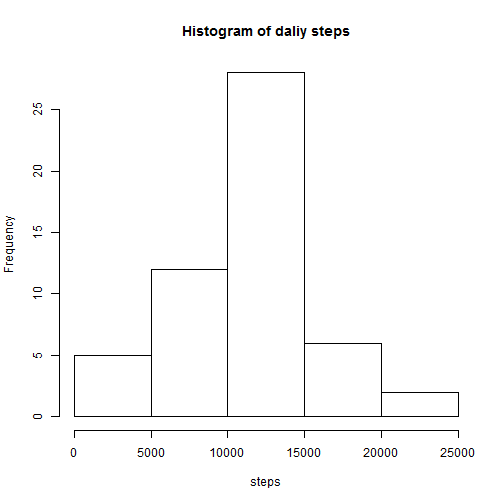
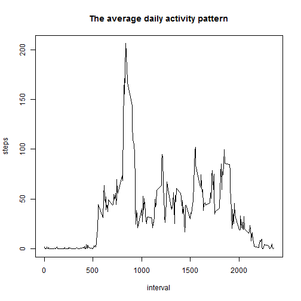
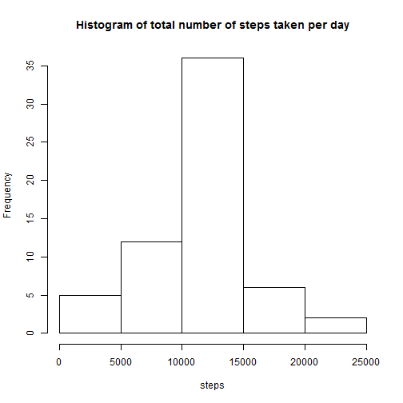

# Peer assignment 1

This assignment makes use of data from a personal activity monitoring device. This device collects data at 5 minute intervals through out the day. The data consists of two months of data from an anonymous individual collected during the months of October and November, 2012 and include the number of steps taken in 5 minute intervals each day.

##  Loading and preprocessing the data

    activity: original dataset
    ags:a dateset which store daliy total steps without missing value.


```r
    setwd("d:/");
    activity<-read.csv("./data/activity.csv");
    ags<-aggregate(steps ~ date,data=activity,sum,na.rm=T);
```

## What is mean total number of steps taken per day?

    1. plot a histogram of the total number of steps taken each day:


```r
    with(ags,hist(steps,main="Histogram of daliy steps"));
```

 

    2. Calculate and report the mean and median total number of steps taken per day 
    

```r
    mean(ags$steps);
```

```
## [1] 10766
```

```r
    median(ags$steps);
```

```
## [1] 10765
```

## What is the average daily activity pattern?

    1.Make a time series plot (i.e. type = "l") of the 5-minute interval (x-axis) and the average number of steps taken, averaged across all days (y-axis)  
      
    agi: a dateset which store mean steps of each interval.
      

```r
    agi<-aggregate(steps ~ interval,data=activity,mean,na.rm=T);
    with(agi,plot(interval,steps,type="l",main="The average daily activity pattern"));
```

 

    2.Which 5-minute interval, on average across all the days in the dataset, contains the     maximum number of steps?
      
    

```r
    max_num_steps_interval<-agi[which(agi$steps==max(agi$steps)),][[1]];
    max_num_steps_interval
```

```
## [1] 835
```
  
## Imputing missing values
      
    1.Calculate and report the total number of missing values in the dataset (i.e. the total number of rows with NAs)  
      

```r
    missing<-length(which(is.na(activity)));
    missing;
```

```
## [1] 2304
```
   
   2. Filling in all of the missing values in the dataset with the mean for that 5-minute interval.     
   3.Create a new dataset (a1) that is equal to the original dataset(activity) but with the missing data filled in.  
   

```r
    a1<-activity;
    a1[which(is.na(a1)),]$steps<-agi$steps;
```
  
    4.Make a histogram of the total number of steps taken each day and Calculate and report the mean and median total number of steps taken per day.   
    

```r
    with(aggregate(steps ~ date,data=a1,sum,na.rm=T),hist(steps,main="Histogram of total number of steps taken per day"));
```

 
  
    These values differs from the estimates from the first part of the assignment Since the missing data were filled using estimated value.The frequency of the middle of the total daily number of steps is highter than that without missing value in part 1. The mean equals to median (10766),while median was 10765 (without missing values) in part 1.
    

```r
    mean(aggregate(steps ~ date,data=a1,sum,na.rm=T)$steps);
```

```
## [1] 10766
```

```r
    median(aggregate(steps ~ date,data=a1,sum,na.rm=T)$steps);
```

```
## [1] 10766
```
    
## Are there differences in activity patterns between weekdays and weekends?
    
    1.Create a new factor variable (wknd) in the dataset with two levels – “weekday” and “weekend” indicating whether a given date is a weekday or weekend day.      
    
    agnai:a dataset which store mean steps of each interval by "weekday" or "weekend".
      

```r
    Sys.setlocale("LC_TIME","English");
```

```
## [1] "English_United States.1252"
```

```r
    a1$wknd<-ifelse(weekdays(as.Date(a1$date))=="Saturday"|weekdays(as.Date(a1$date))=="Sunday","weekend","weekday")
    agnai<-aggregate(steps ~ interval+wknd,data=a1,mean,na.rm=T);
```
  
    2.Make a panel plot containing a time series plot (i.e. type = "l") of the 5-minute interval (x-axis) and the average number of steps taken, averaged across all weekday days or weekend days (y-axis).   
    

```r
    library(latticeExtra);
```

```
## Loading required package: RColorBrewer
## Loading required package: lattice
```

```r
    xyplot(steps ~ interval | wknd,type="l",data=agnai);
```

 
    
